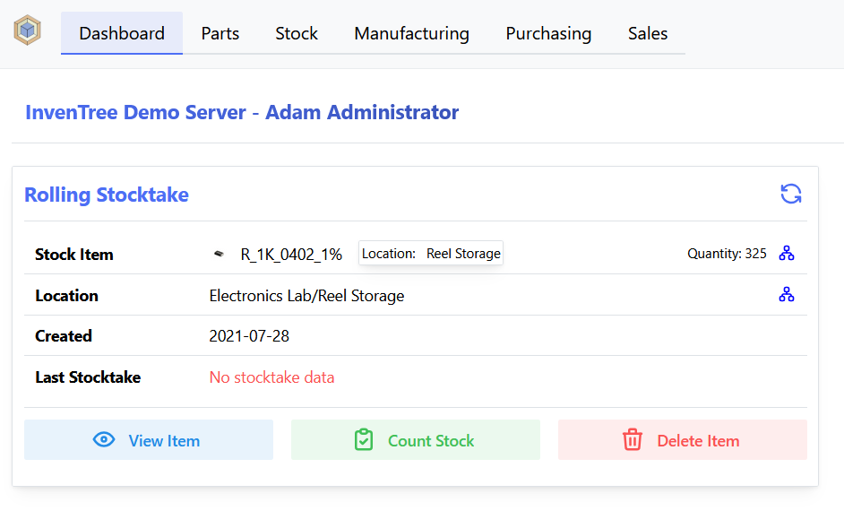
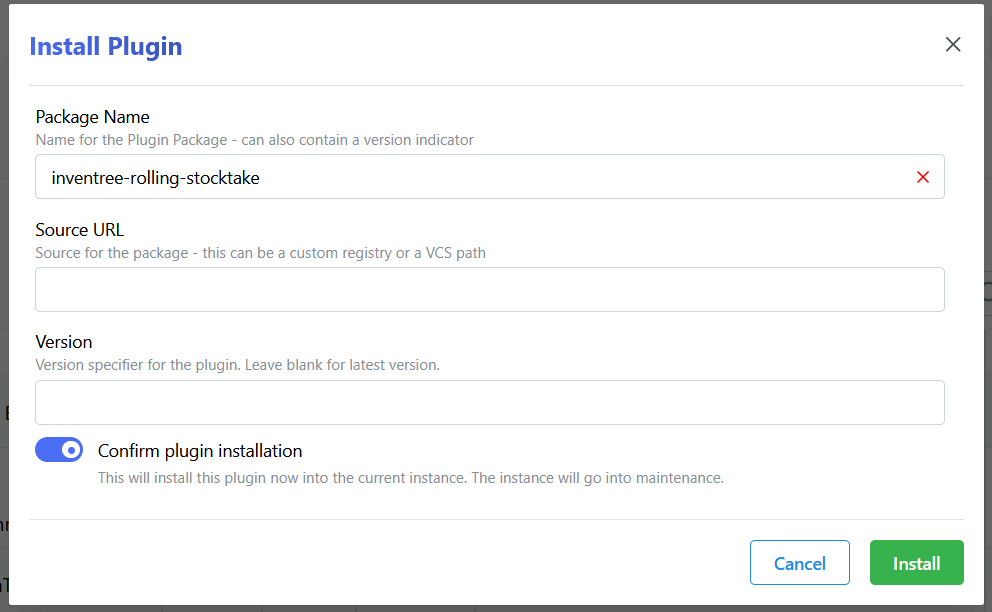
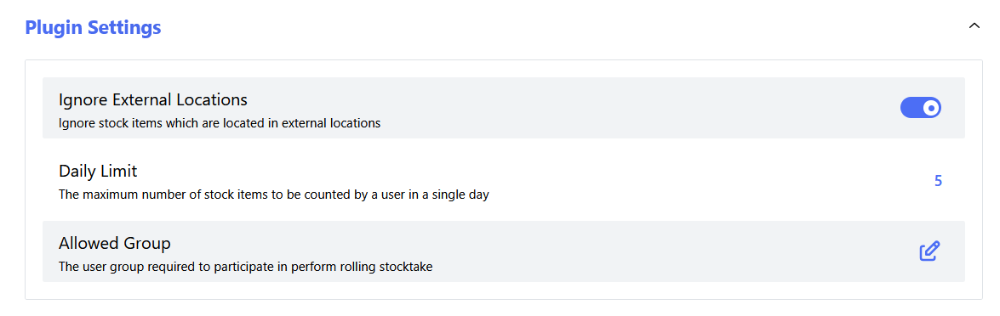

[](https://opensource.org/licenses/MIT)
[](https://pypi.org/project/inventree-rolling-stocktake/)


# Rolling Stocktake Plugin
 
This is as plugin for [InvenTree](https://inventree.org) which provides integration of rolling stocktake for InvenTree.

## Description

Rolling stocktake is a method of inventory management where a small subset of inventory is counted on a regular basis, rather than counting the entire inventory at once. This plugin provides tools to facilitate rolling stocktake operations within InvenTree.

### Features

The plugin provides the following features:

- A backend API endpoint to retrieve items which are due for stocktake
- A frontend interface to view and manage rolling stocktake operations
- Automatic daily marking of stale stock items as requiring stocktake

### Dashboard Widget

Users are presented with a custom widget on their dashboard, which automatically fetches a single stock item which is due for stocktake:



This widget allows users to quickly and easily perform stocktake operations on individual items. Once stocktake has been performed on a given item, the next item which is due for stocktake is automatically fetched.

## Installation

Install the plugin using the methods described below.

*Note: After the plugin is installed, it must be activated via the InvenTree plugin interface.*

### Via User Interface

Installation via the InvenTree plugin manager is the recommended approach:

The simplest way to install this plugin is from the InvenTree plugin interface. Enter the plugin name (`inventree-rolling-stocktake`) and click the `Install` button:



### Via Pip

To install manually via the command line, run the following command:

```bash
pip install rolling-stocktake
```

*Note: You must be operating within the InvenTree virtual environment!*

## Automatic Stale Marking

The plugin runs a daily background task that automatically marks stock items as requiring stocktake. An item is considered stale when:

- It was created before the configured **Stale Period** threshold, and
- It has not been counted since the same threshold (or has never been counted)

Stale items are assigned the configured **Stale Status** stock status code. This makes them easy to identify and prioritise in the dashboard widget and elsewhere.

> **Note:** If the **Stale Status** setting is not configured (left blank), the automatic marking function will not run. Both the *Stale Status* and *Stale Period* settings must be set for this feature to take effect.

Items that are already assigned the stale status, are located in external locations (if *Ignore External Locations* is enabled), or belong to inactive parts (if *Ignore Inactive Parts* is enabled) are excluded from processing.

## Configuration

The plugin can be configured via the InvenTree plugin interface. The following settings are available:

| Setting | Description |
| --- | --- |
| Allowed Group | Specify a group which is allowed to perform rolling stocktake operations. Leave blank to allow all users. |
| Weekly Limit | Maximum number of stock items a user can count in a single week. |
| Random Pool | Number of candidates to randomly select from when choosing the next item (0 = always pick the oldest). |
| Ignore External Locations | Ignore stock items which are located in external locations. |
| Ignore Inactive Parts | Ignore stock items which belong to inactive parts. |
| Display Creature | Display a creature on the dashboard widget when there are items to be counted. |
| Stale Period | Number of days after which an uncounted stock item is considered stale. |
| Stale Status | Stock status code applied to items identified as stale. **Leave blank to disable automatic stale marking.** |


